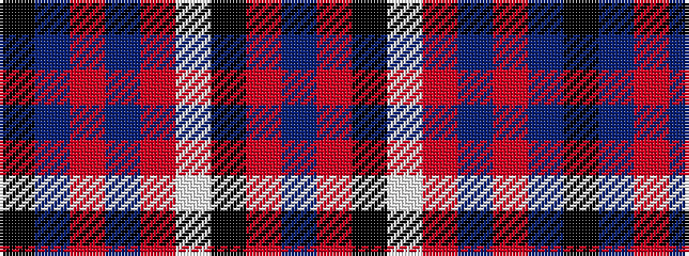

BRKWRBRBK

It is a 9 stripe tartan.

<figure class="pat-woven">

<figcaption>idealised sample</figcaption>
</figure>

## Colour Sequence



## Tartans with this colour sequence

| Tartans |
|---------------|
| [United Arrows House Check](/setts/s9/db45r4k20lb3o9dr4o3dr9k11~x2/)|
||
