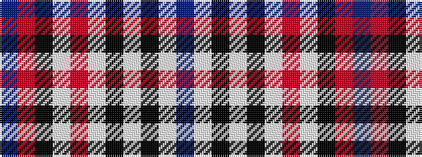

BRKWRWKWKWB

It is a 11 stripe tartan.

<figure class="pat-woven">

<figcaption>idealised sample</figcaption>
</figure>

## Colour Sequence



## Tartans with this colour sequence

| Tartans |
|---------------|
| [MacRae, Dress Red (Dance)](/setts/s11/t1r3k2w1r8w1k2w9k1w3t1~x6/)|
||
