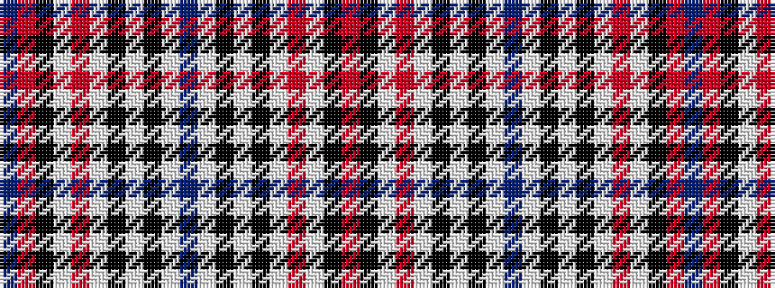

BRKWRWKWKWBWKWKWRWKR

It is a 20 stripe tartan.

<figure class="pat-woven">

<figcaption>idealised sample</figcaption>
</figure>

## Colour Sequence



## Tartans with this colour sequence

| Tartans |
|---------------|
| [MacRae Dress Red Fancy Tartan Tartan Number: 6529. Earliest known date: 2000 A dance version of MacRae Dress. From a sample provided by Tartantown. See products available Copyright © Blair Urquhart, Comrie, 2015](/setts/s20/r3k2w1r8w1k2w9k1w3t1w3k1w9k2w1r8w1k2r3t1~x6/)|
||
