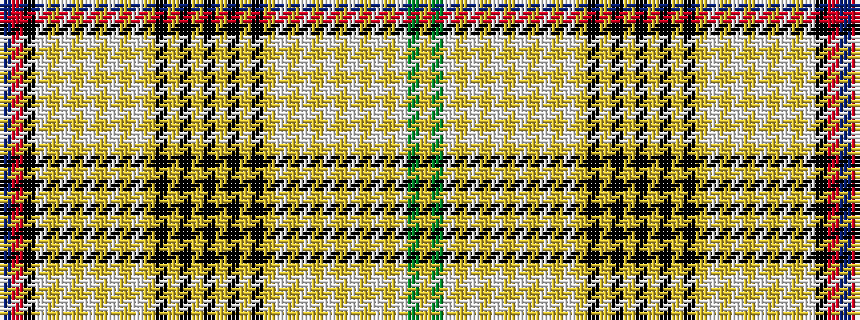

BRKWYWYWYWYWYKYKYKYKYKYWYWYWYWYWYWGY

It is a 36 stripe tartan.

<figure class="pat-woven">

<figcaption>idealised sample</figcaption>
</figure>

## Colour Sequence



## Tartans with this colour sequence

| Tartans |
|---------------|
| [All Breeds Dairy Goats (Corporate)](/setts/s36/db10r10k36w1lo1w1lo1w1lo1w1lo1w1lo1k1lo1k1lo1k1lo1k1lo1k1lo1w1lo1w1lo1w1lo1w1lo1w1lo26w26g10ly10~x2/)|
||
