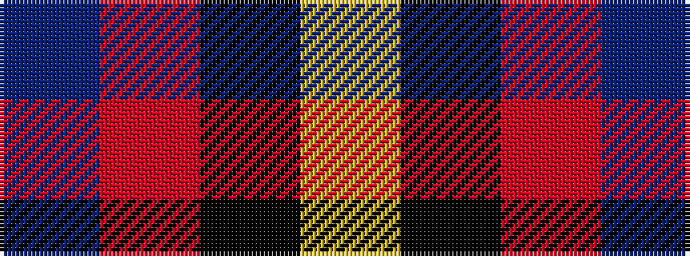

BRKY

It is a 4 stripe tartan.

<figure class="pat-woven">

<figcaption>idealised sample</figcaption>
</figure>

## Colour Sequence



## Tartans with this colour sequence

| Tartans |
|---------------|
| [Kucher, Gregory](/setts/s4/db8r1k1lr1~x10/)|
||
| [Kucher, Gregory (Personal)](/setts/s4/n2r1k1lr1~x10/)|
||
| [Skinner](/setts/s4/db1r16k16ly1~x4/)|
||
| [Skinner (Name)](/setts/s4/db1r8k8lo1~x4/)|
||
