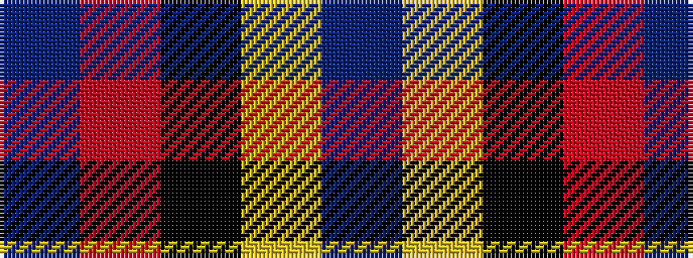

BRKYB

It is a 5 stripe tartan.

<figure class="pat-woven">

<figcaption>idealised sample</figcaption>
</figure>

## Colour Sequence



## Tartans with this colour sequence

| Tartans |
|---------------|
| [Thomas, Jean Marc (Personal)](/setts/s5/t72r16k5ly2dt16~x2/)|
||
