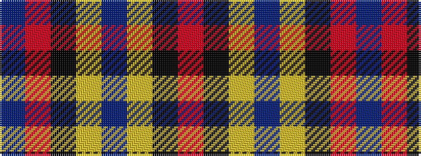

BRKYBYKR

It is a 8 stripe tartan.

<figure class="pat-woven">

<figcaption>idealised sample</figcaption>
</figure>

## Colour Sequence



## Tartans with this colour sequence

| Tartans |
|---------------|
| [Thomas Jean Marc Personal Tartan Tartan Number: 6990. Earliest known date: 2005 A personal tartan for Jean Marc Thomas, Paris. See products available Copyright © Blair Urquhart, Comrie, 2015](/setts/s8/t72r16k5ly2dt16~x2/)|
||
