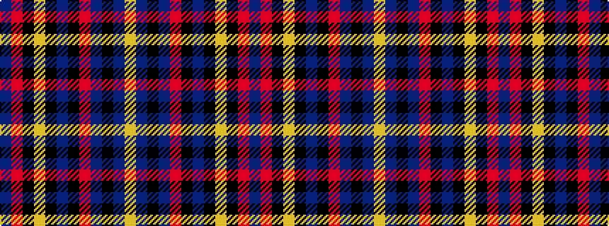

BRKYKBKRBKBY

It is a 12 stripe tartan.

<figure class="pat-woven">

<figcaption>idealised sample</figcaption>
</figure>

## Colour Sequence



## Tartans with this colour sequence

| Tartans |
|---------------|
| [Bates-Dayton](/variants/s12/dp3r17k3lo3k3dp3k3r7dp8k3dp1lo3~x4/)|
||
