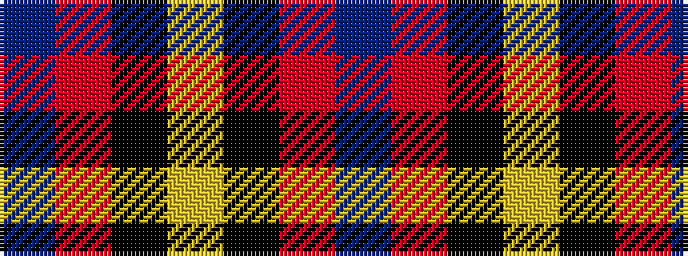

BRKYKRB

It is a 7 stripe tartan.

<figure class="pat-woven">

<figcaption>idealised sample</figcaption>
</figure>

## Colour Sequence



## Tartans with this colour sequence

| Tartans |
|---------------|
| [Salvation Army, dress](/setts/s7/db80r21k2ly4k2r16db10~x2/)|
||
