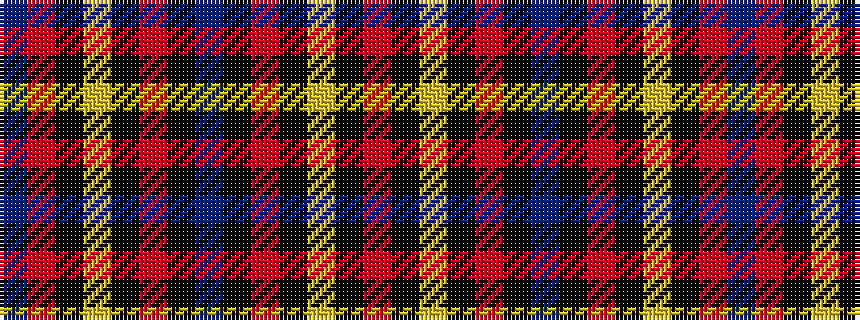

BRKYKRKBKRKYKR

It is a 14 stripe tartan.

<figure class="pat-woven">

<figcaption>idealised sample</figcaption>
</figure>

## Colour Sequence



## Tartans with this colour sequence

| Tartans |
|---------------|
| [Salvation Army Dress](/setts/s14/r16k2ly4k2r15k2db74k2r15k2ly4k2r16db10~x2/)|
||
