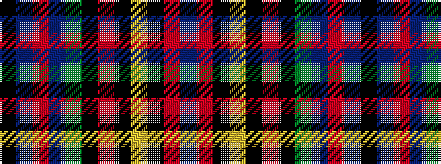

BRKYKRKGBRBK

It is a 12 stripe tartan.

<figure class="pat-woven">

<figcaption>idealised sample</figcaption>
</figure>

## Colour Sequence



## Tartans with this colour sequence

| Tartans |
|---------------|
| [Buffalo (Fashion)](/setts/s12/db6o3k4ly3k3o3k3g14t28o3t3k2~x2/)|
||
