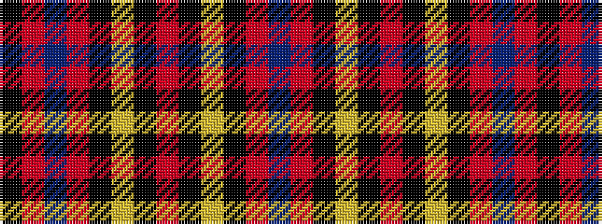

BRKYKRKYKRBRK

It is a 13 stripe tartan.

<figure class="pat-woven">

<figcaption>idealised sample</figcaption>
</figure>

## Colour Sequence



## Tartans with this colour sequence

| Tartans |
|---------------|
| [Leslie (J Cant)](/variants/s13/db50r2k3ly2k3r2k3ly2k3r2db3r12k2~x2/)|
||
