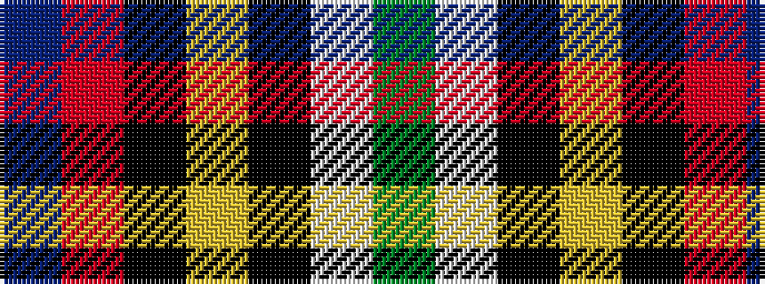

BRKYKWG

It is a 7 stripe tartan.

<figure class="pat-woven">

<figcaption>idealised sample</figcaption>
</figure>

## Colour Sequence



## Tartans with this colour sequence

| Tartans |
|---------------|
| [Scotch House 2000 Dress](/setts/s7/g22w3k2ly3k19r18db4~x2/)|
||
