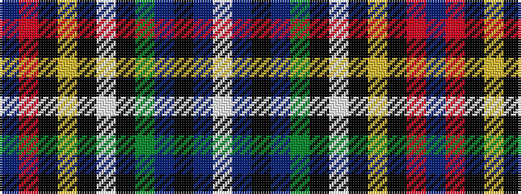

BRKYKWKGBKBW

It is a 12 stripe tartan.

<figure class="pat-woven">

<figcaption>idealised sample</figcaption>
</figure>

## Colour Sequence



## Tartans with this colour sequence

| Tartans |
|---------------|
| [MacBeth/Stewart Brydone 1862](/variants/s12/db33r8k12ly2k4w4k4dg12db8k4db4w2~x2/)|
||
| [MacLulich](/variants/s12/db33r8k12ly2k4w4k4g12db8k4db4w2~x2/)|
||
| [Wcwm 1105](/variants/s12/db84r3k16ly4k4lb4k4dg20db8k4db8lb4/)|
||
