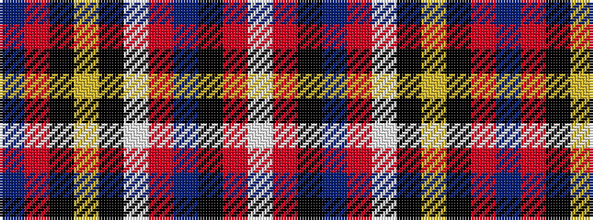

BRKYKWRBKRW

It is a 11 stripe tartan.

<figure class="pat-woven">

<figcaption>idealised sample</figcaption>
</figure>

## Colour Sequence



## Tartans with this colour sequence

| Tartans |
|---------------|
| [Suffolk County Police (Corporate)](/setts/s11/db74r6k12ly3k3w3r16db8k3r4w3~x2/)|
||
