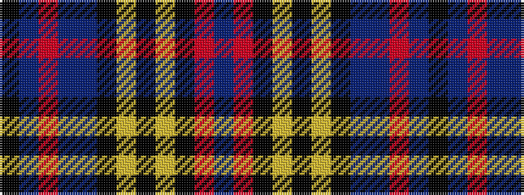

BRKYKYKBBRBK

It is a 12 stripe tartan.

<figure class="pat-woven">

<figcaption>idealised sample</figcaption>
</figure>

## Colour Sequence



## Tartans with this colour sequence

| Tartans |
|---------------|
| [MacLean (Dress)](/variants/s12/db4r1k3lo1k1lr1k1dbi8t12r1t2k1~x4/)|
||
