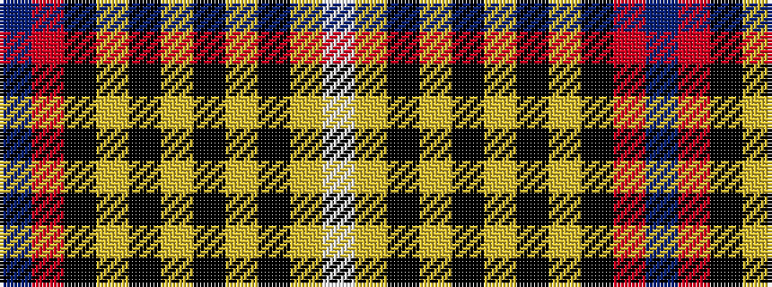

BRKYKYKYKYW

It is a 11 stripe tartan.

<figure class="pat-woven">

<figcaption>idealised sample</figcaption>
</figure>

## Colour Sequence



## Tartans with this colour sequence

| Tartans |
|---------------|
| [Gary](/setts/s11/p2r1k4ly2k12ly8k12ly2k4ly1w2~x2/)|
||
| [Gary (Personal)](/setts/s11/dp2r1k4lo2k12lo8k12lo2k4lo1w2~x4/)|
||
| [Gary Personal Tartan Tartan Number: 564. Earliest known date: 1985 Restricted See products available Copyright © Blair Urquhart, Comrie, 2015](/setts/s11/dp2r1k4ly2k12ly8k12ly2k4ly1w2~x2/)|
||
