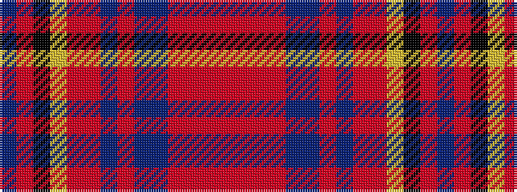

BRKYRRBRBBRRRR

It is a 14 stripe tartan.

<figure class="pat-woven">

<figcaption>idealised sample</figcaption>
</figure>

## Colour Sequence



## Tartans with this colour sequence

| Tartans |
|---------------|
| [Chafee of Glenmary (Personal)](/variants/s14/db2r3k6ly4r17r2db16r2db16db2r15r16r2r2~x2/)|
||
