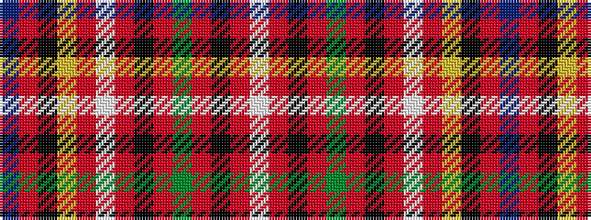

BRKYRWRKRGRKRW

It is a 14 stripe tartan.

<figure class="pat-woven">

<figcaption>idealised sample</figcaption>
</figure>

## Colour Sequence



## Tartans with this colour sequence

| Tartans |
|---------------|
| [Unidentified Specimen](/setts/s14/db72r11k12ly2r2w3r2k2r10dg18r10k3r3w2~x2/)|
||
| [Unidentified, specimen](/setts/s14/db72r11k12ly2r2w3r2k2r10g18r10k3r3w2~x2/)|
||
