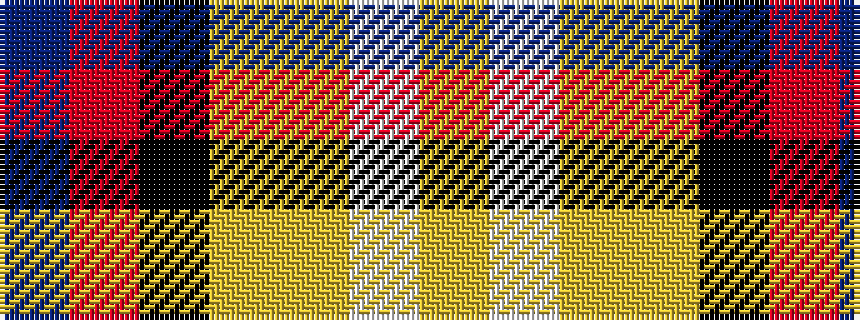

BRKYYWY

It is a 7 stripe tartan.

<figure class="pat-woven">

<figcaption>idealised sample</figcaption>
</figure>

## Colour Sequence



## Tartans with this colour sequence

| Tartans |
|---------------|
| [U.S. Forces Thurso (Military)](/setts/s7/db40r3k10lo2lr15w2lr4~x2/)|
||
