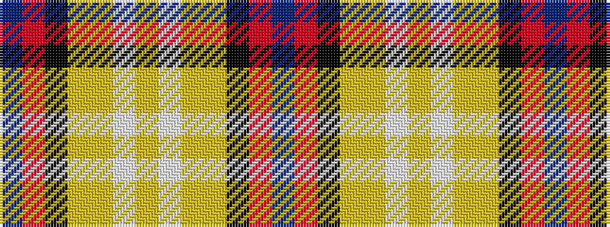

BRKYYWYWYYKRB

It is a 13 stripe tartan.

<figure class="pat-woven">

<figcaption>idealised sample</figcaption>
</figure>

## Colour Sequence



## Tartans with this colour sequence

| Tartans |
|---------------|
| [U.S. Forces Thurso](/variants/s13/db20r3k10lo2lr15w2lr4w2lr15lo2k10r3db20~x2/)|
||
