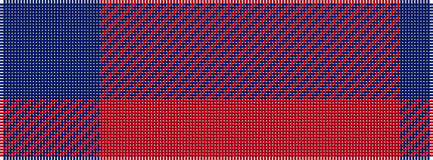

BRR

It is a 3 stripe tartan.

<figure class="pat-woven">

<figcaption>idealised sample</figcaption>
</figure>

## Colour Sequence



## Tartans with this colour sequence

| Tartans |
|---------------|
| [Masai Shuka 19 (Artefact)](/setts/s3/b10r10ri3~x2/)|
||
