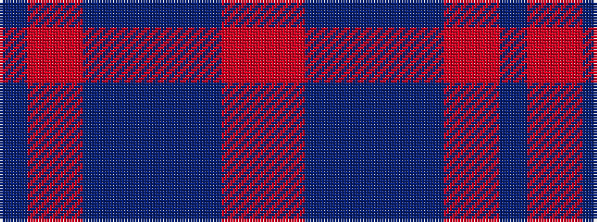

BRRBBBBBRR

It is a 10 stripe tartan.

<figure class="pat-woven">

<figcaption>idealised sample</figcaption>
</figure>

## Colour Sequence



## Tartans with this colour sequence

| Tartans |
|---------------|
| [Southdown Grey](/setts/s10/do3o2r1do2n6do6n4do6o22r3~x4/)|
||
