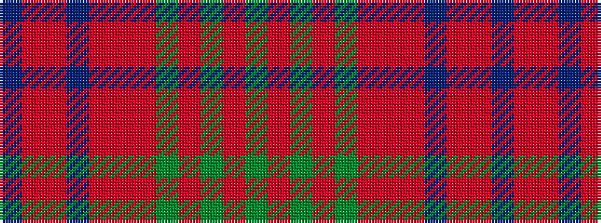

BRRBRRRGRGRG

It is a 12 stripe tartan.

<figure class="pat-woven">

<figcaption>idealised sample</figcaption>
</figure>

## Colour Sequence



## Tartans with this colour sequence

| Tartans |
|---------------|
| [Powys (District)](/variants/s12/dg24r7dg7r7dg7r22r7r4b4r4r40b14/)|
||
