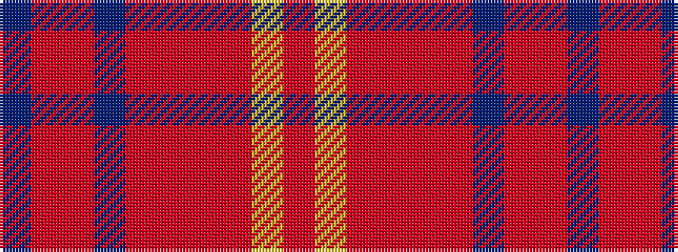

BRRBRRRRYR

It is a 10 stripe tartan.

<figure class="pat-woven">

<figcaption>idealised sample</figcaption>
</figure>

## Colour Sequence



## Tartans with this colour sequence

| Tartans |
|---------------|
| [Star Is Born, A](/variants/s10/oi2lo14o14r1oi2r2b2r2oi20b2~x4/)|
||
