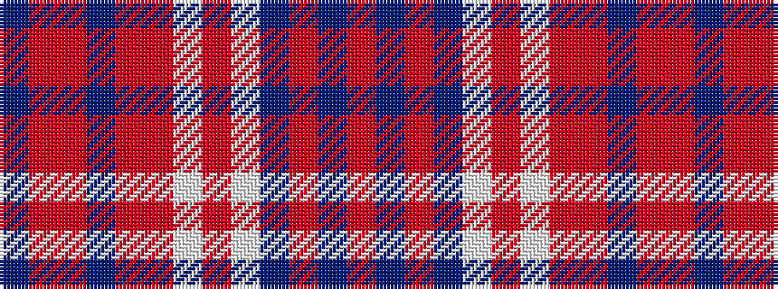

BRRBRRWRWBRBR

It is a 13 stripe tartan.

<figure class="pat-woven">

<figcaption>idealised sample</figcaption>
</figure>

## Colour Sequence



## Tartans with this colour sequence

| Tartans |
|---------------|
| [Florence (Fashion)](/variants/s13/oii32dp8oii1dp1w1oii1w1o1oii1dp1oi1oii4dp1~x4/)|
||
