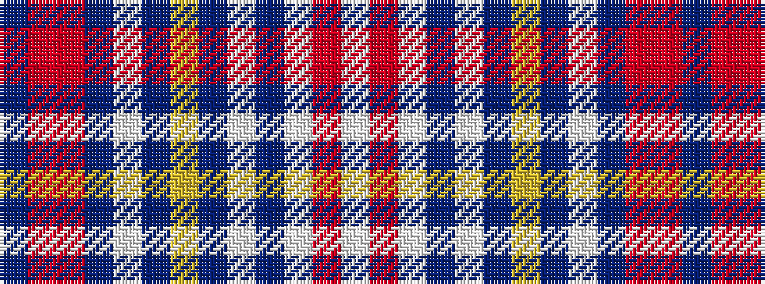

BRRBWBYBWBWRW

It is a 13 stripe tartan.

<figure class="pat-woven">

<figcaption>idealised sample</figcaption>
</figure>

## Colour Sequence



## Tartans with this colour sequence

| Tartans |
|---------------|
| [Warden](/setts/s13/w4r1w5db1w3dbi5ly1dbi2w1dbi2o8r16db2~x4/)|
||
