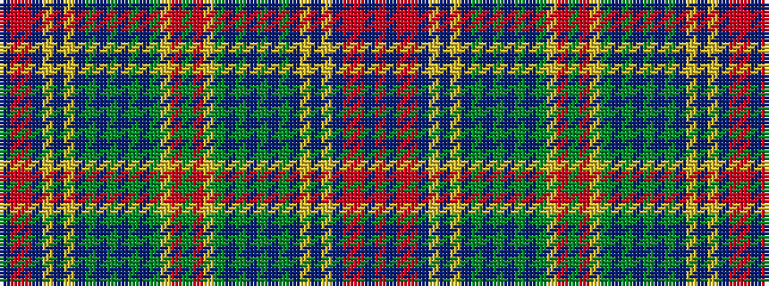

BRRBYBYBGBGBGBGYRGRYGBGBGBGBYBYBRRBR

It is a 36 stripe tartan.

<figure class="pat-woven">

<figcaption>idealised sample</figcaption>
</figure>

## Colour Sequence



## Tartans with this colour sequence

| Tartans |
|---------------|
| [Hart of Scotland](/setts/s36/ri5db3ri3r2db2ly2db2ly1db14g2db7g4db4g7db2g9ly1o2g5~x2/)|
||
