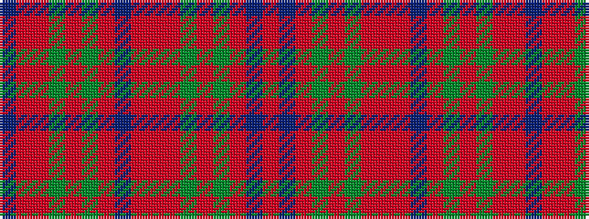

BRRGRGRBRRRGRGRBR

It is a 17 stripe tartan.

<figure class="pat-woven">

<figcaption>idealised sample</figcaption>
</figure>

## Colour Sequence



## Tartans with this colour sequence

| Tartans |
|---------------|
| [MacDougall #3](/setts/s17/ri30dp3r3dg12r12dg12ri8r3ri8dp12r5dg3r5dg25r4ri6t1~x2/)|
||
| [MacDougall 2](/setts/s17/r30p3ri3g12ri12g12r8ri3r8p12ri5g3ri5g25ri4r6t1~x2/)|
||
