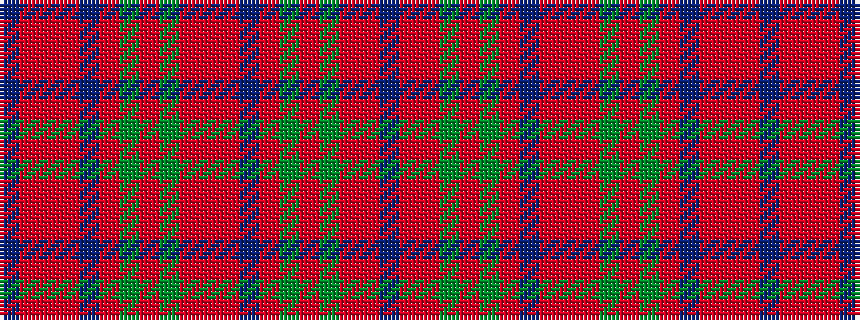

BRRGRGRBRRRGRGRBRRRB

It is a 20 stripe tartan.

<figure class="pat-woven">

<figcaption>idealised sample</figcaption>
</figure>

## Colour Sequence



## Tartans with this colour sequence

| Tartans |
|---------------|
| [MacDougal 2](/setts/s20/t1r12r4g72r8g4r8db18r12r4r12g18r18g18r8db4r72r6r4t1~x2/)|
||
| [MacDougall (Logan)](/setts/s20/t1r12r4dg72r8dg4r8db18r12r4r12dg18r18dg18r8db4r72r6r4t1~x2/)|
||
