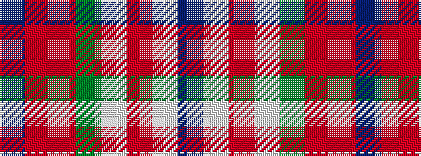

BRRGWRWB

It is a 8 stripe tartan.

<figure class="pat-woven">

<figcaption>idealised sample</figcaption>
</figure>

## Colour Sequence



## Tartans with this colour sequence

| Tartans |
|---------------|
| [Serco Caledonian Sleeper](/setts/s8/db18o4ri4g12lb3r2w2dp10~x2/)|
||
