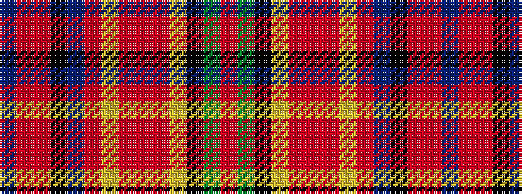

BRRKBRYRRRYKGR

It is a 14 stripe tartan.

<figure class="pat-woven">

<figcaption>idealised sample</figcaption>
</figure>

## Colour Sequence



## Tartans with this colour sequence

| Tartans |
|---------------|
| [Roman Family Tribute (Personal)](/setts/s14/r27dg20k7ly3o3r2o3ly3o6dp6k2r3o4dp3~x2/)|
||
