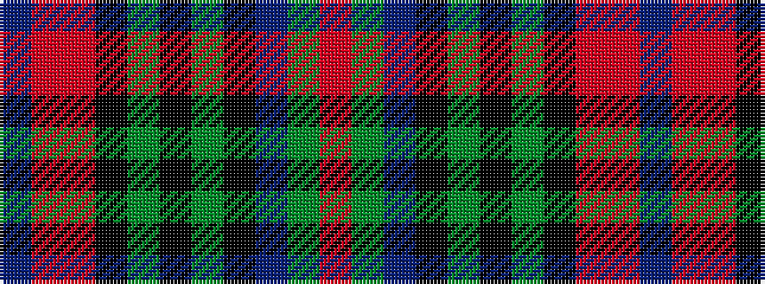

BRRKGKGKBGR

It is a 11 stripe tartan.

<figure class="pat-woven">

<figcaption>idealised sample</figcaption>
</figure>

## Colour Sequence



## Tartans with this colour sequence

| Tartans |
|---------------|
| [Okada, Yayoi (Personal)](/variants/s11/db1m1r5k1dg1k1dg1k5db10dg1r1~x4/)|
||
