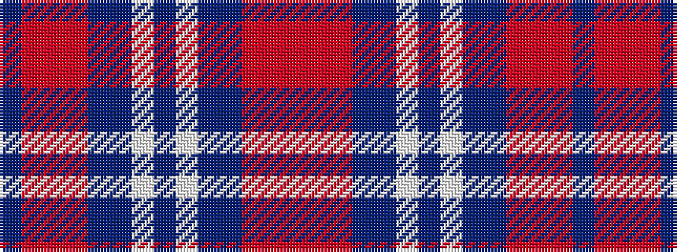

BRRRBBWBWBBRRR

It is a 14 stripe tartan.

<figure class="pat-woven">

<figcaption>idealised sample</figcaption>
</figure>

## Colour Sequence



## Tartans with this colour sequence

| Tartans |
|---------------|
| [Scottish Highlander Dress](/variants/s14/p26w2p3db15o26r2o3db4~x2/)|
||
