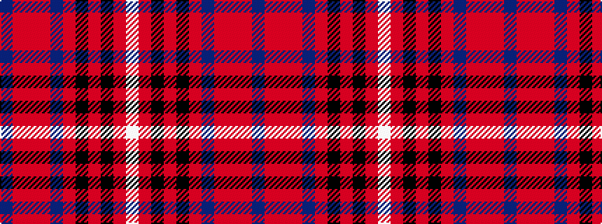

BRRRBRKRKRW

It is a 11 stripe tartan.

<figure class="pat-woven">

<figcaption>idealised sample</figcaption>
</figure>

## Colour Sequence



## Tartans with this colour sequence

| Tartans |
|---------------|
| [MacHatters of the Old Pueblo](/setts/s11/dp7m2r2ri2dp23ri2k2ri1k15r29lp2~x2/)|
||
