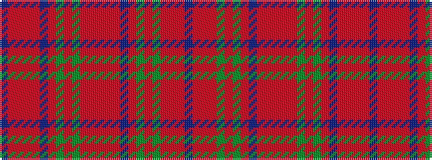

BRRRGRGRBRRRRRGRGRBRRRRB

It is a 24 stripe tartan.

<figure class="pat-woven">

<figcaption>idealised sample</figcaption>
</figure>

## Colour Sequence



## Tartans with this colour sequence

| Tartans |
|---------------|
| [MacDougal 1](/variants/s24/t1r4ri2rii2g27rii4g2rii4p10r3ri2rii2ri2r3g10rii10g10rii2p2rii26r3ri2rii3t1~x2/)|
||
| [MacDougall #2](/variants/s24/t1r5ri2rii3r25db2r2dg11r11dg11rii3ri2r2ri2rii3db11r5dg2r5dg24r3ri2rii5t1~x2/)|
||
| [MacDougall (Wilson)](/variants/s24/t1rii4ri2r2dg27r4dg2r4dp10rii3ri2r2ri2rii3dg10r10dg10r2dp2r26rii3ri2r3t1~x2/)|
||
| [MacDougall 5](/variants/s24/t1ri5r2rii3ri25db2ri2g11ri11g11rii3r2ri2r2rii3db11ri5g2ri5g24ri3r2rii5t1~x2/)|
||
