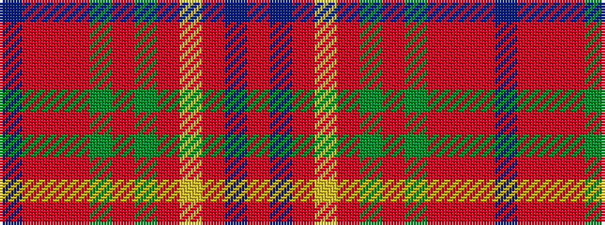

BRRRGRGRYRBR

It is a 12 stripe tartan.

<figure class="pat-woven">

<figcaption>idealised sample</figcaption>
</figure>

## Colour Sequence



## Tartans with this colour sequence

| Tartans |
|---------------|
| [McPrato](/setts/s12/r52db12o9ly2o2g2o2g11r7o2r3db2~x2/)|
||
