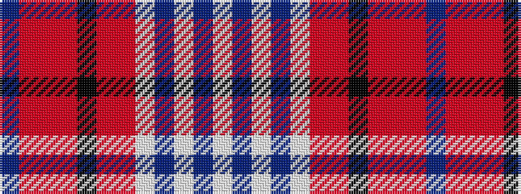

BRRRKRRWBWBW

It is a 12 stripe tartan.

<figure class="pat-woven">

<figcaption>idealised sample</figcaption>
</figure>

## Colour Sequence



## Tartans with this colour sequence

| Tartans |
|---------------|
| [Confederate Memorial](/setts/s12/t12o4r4o4k2o56r18w1db4w3db4w1~x2/)|
||
