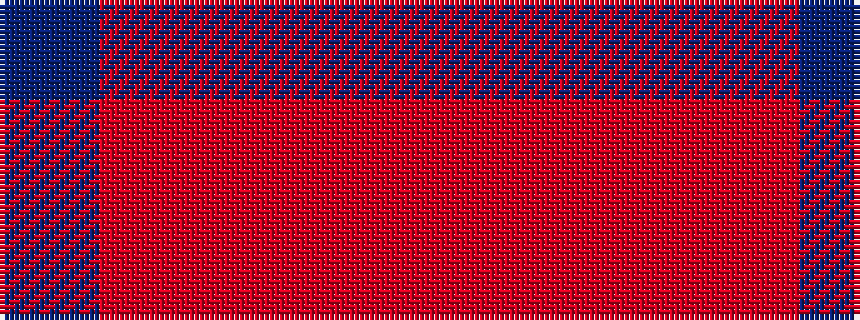

BRRRR

It is a 5 stripe tartan.

<figure class="pat-woven">

<figcaption>idealised sample</figcaption>
</figure>

## Colour Sequence



## Tartans with this colour sequence

| Tartans |
|---------------|
| [Mowbray (Moubray) Family Tartan Tartan Number: 565. Earliest known date: 1983 Designed C.1984 by Peter MacDonald for a Mr Mowbray in the USA. Sometimes woven with green in place of gray, and blue in place of azure. See products available Copyright © Blair Urquhart, Comrie, 2015](/setts/s5/o16r2o10r15t5~x2/)|
||
