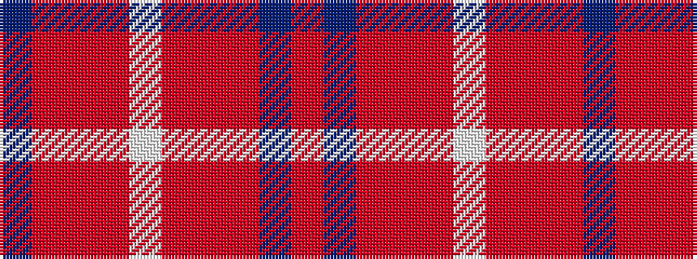

BRRRWRRRBR

It is a 10 stripe tartan.

<figure class="pat-woven">

<figcaption>idealised sample</figcaption>
</figure>

## Colour Sequence



## Tartans with this colour sequence

| Tartans |
|---------------|
| [Fernie (Personal)](/setts/s10/r25dt5o2r12oi1w1~x2/)|
||
