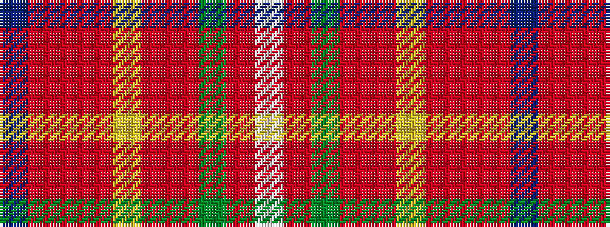

BRRRYRRGRW

It is a 10 stripe tartan.

<figure class="pat-woven">

<figcaption>idealised sample</figcaption>
</figure>

## Colour Sequence



## Tartans with this colour sequence

| Tartans |
|---------------|
| [Hello Kitty (Corporate)](/setts/s10/do2ri3r3ri21ly3ri2r6g6r4lb2~x2/)|
||
