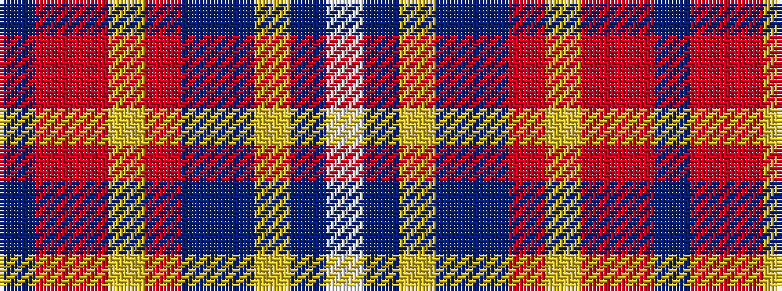

BRRYRBBYBW

It is a 10 stripe tartan.

<figure class="pat-woven">

<figcaption>idealised sample</figcaption>
</figure>

## Colour Sequence



## Tartans with this colour sequence

| Tartans |
|---------------|
| [University of Dundee](/setts/s10/dbi5o4r6lo1r9db35dbi5lo1dbi12w1~x2/)|
||
