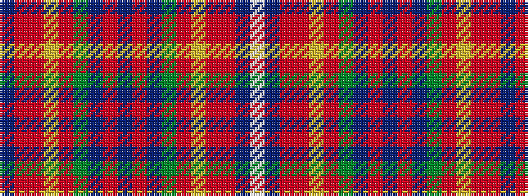

BRRYRGBRBRBGRYRRBW

It is a 18 stripe tartan.

<figure class="pat-woven">

<figcaption>idealised sample</figcaption>
</figure>

## Colour Sequence



## Tartans with this colour sequence

| Tartans |
|---------------|
| [Guild, The](/setts/s18/db20r1ri3lr1ri30dg5db8r1db8r1db8dg5ri30lr1ri3r1db20w2~x2/)|
||
