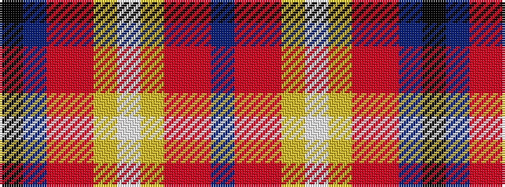

BRRYWYRRBK

It is a 10 stripe tartan.

<figure class="pat-woven">

<figcaption>idealised sample</figcaption>
</figure>

## Colour Sequence



## Tartans with this colour sequence

| Tartans |
|---------------|
| [MacHattie Family Tartan Tartan Number: 5917. Earliest known date: 2003 A tartan for the McHattie family of Aberdeen See products available Copyright © Blair Urquhart, Comrie, 2015](/setts/s10/k45dt2ri2r2ly1w1~x2/)|
||
