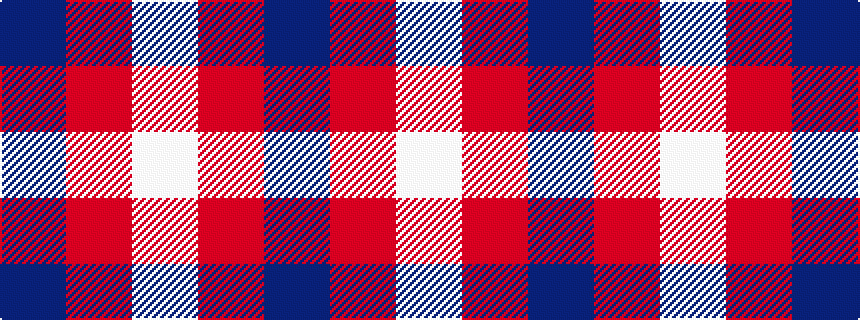

BRW

It is a 3 stripe tartan.

<figure class="pat-woven">

<figcaption>idealised sample</figcaption>
</figure>

## Colour Sequence



## Tartans with this colour sequence

| Tartans |
|---------------|
| [Masai Shuka 28 (Artefact)](/variants/s3/lb9r20db2~x2/)|
||
