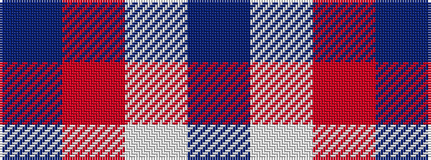

BRWB

It is a 4 stripe tartan.

<figure class="pat-woven">

<figcaption>idealised sample</figcaption>
</figure>

## Colour Sequence



## Tartans with this colour sequence

| Tartans |
|---------------|
| [Masai Shuka 22 (Artefact)](/variants/s4/db20w1r12db12~x4/)|
||
