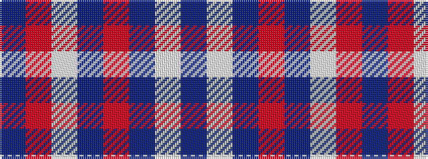

BRWBRBWB

It is a 8 stripe tartan.

<figure class="pat-woven">

<figcaption>idealised sample</figcaption>
</figure>

## Colour Sequence



## Tartans with this colour sequence

| Tartans |
|---------------|
| [Americana - 1978 (Fashion)](/setts/s8/db33w7db5r2db5w2r13db3~x2/)|
||
