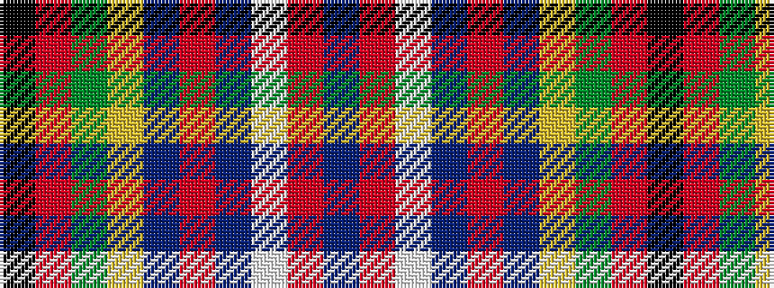

BRWBRBYGRK

It is a 10 stripe tartan.

<figure class="pat-woven">

<figcaption>idealised sample</figcaption>
</figure>

## Colour Sequence



## Tartans with this colour sequence

| Tartans |
|---------------|
| [Boisserolles de St-Julien, Baron of](/variants/s10/db4o4w1db2o50db20ly1dg25r4k2~x2/)|
||
| [Philip Boisserolles de St-Julien, baron of Hartsyde (Personal)](/variants/s10/dt4o4w1dt2o50dt20ly1y25r4k2~x2/)|
||
