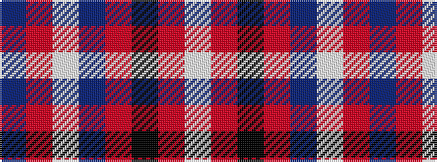

BRWBRKRW

It is a 8 stripe tartan.

<figure class="pat-woven">

<figcaption>idealised sample</figcaption>
</figure>

## Colour Sequence



## Tartans with this colour sequence

| Tartans |
|---------------|
| [Knights Templar - Grand Priory (Corp](/setts/s8/db1r2w1db30r30k1r2w1~x2/)|
||
