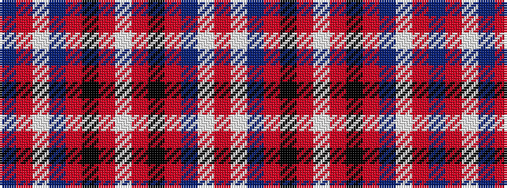

BRWBRKRWRKRBWR

It is a 14 stripe tartan.

<figure class="pat-woven">

<figcaption>idealised sample</figcaption>
</figure>

## Colour Sequence



## Tartans with this colour sequence

| Tartans |
|---------------|
| [Knights Templar - Grand Priory](/setts/s14/r2w1db30r30k1r2w1r2k1r30db30w1r2db1~x2/)|
||
